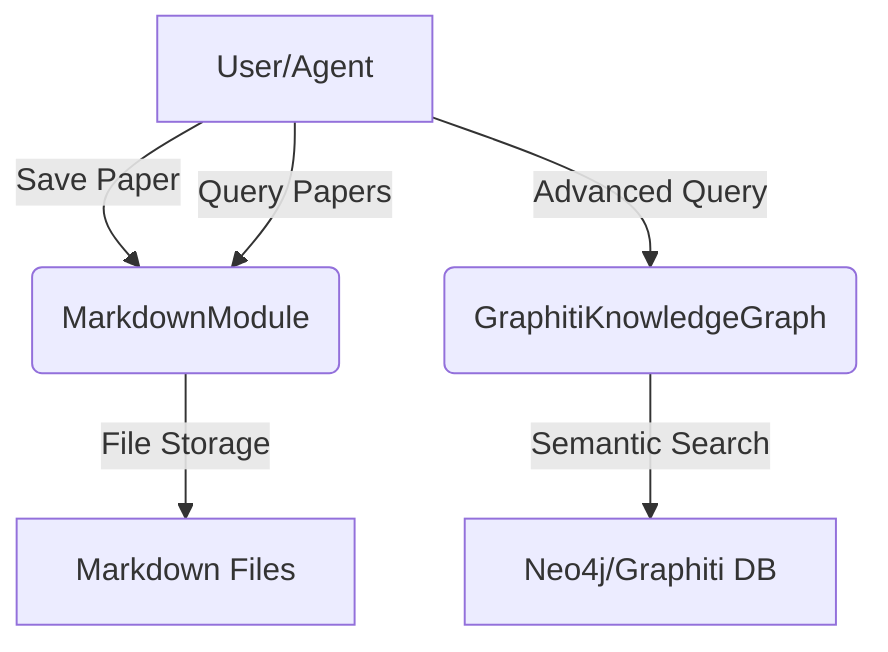

# Architecture: Scientific Paper Knowledge Base

## Overview
This system is an AI-powered knowledge base designed specifically for storing, querying, and analyzing scientific papers. It leverages modern LLMs, a knowledge graph backend (Graphiti), and a modular Python architecture.

## Main Components

### 1. MarkdownModule
- Stores scientific paper knowledge as Markdown files on disk.
- Organizes papers by title and DOI.
- Provides methods to save, list, and delete papers.

### 2. GraphitiKnowledgeGraph
- (Optional/Advanced) Stores and queries scientific paper entities in a Neo4j/Graphiti-powered knowledge graph.
- Supports advanced semantic search and entity extraction for scientific papers.

### 3. KnowledgeBaseService
- High-level API that abstracts over Markdown and Graphiti backends.
- Used by agents and scripts to interact with the knowledge base.

### 4. Agents (ADK/LLM Integration)
- (Optional) Multi-agent system for advanced reasoning, retrieval, and workflow automation.
- Can be extended to support scientific paper summarization, citation analysis, etc.

## Data Flow

### Storing a Scientific Paper
1. User (or agent) calls `KnowledgeBaseService.markdown_module.save()` with paper metadata and content.
2. MarkdownModule creates a directory for the paper and stores the content as a Markdown file (optionally using DOI as filename).
3. (Optional) The paper can also be indexed in the Graphiti knowledge graph for semantic search.

### Querying Papers
1. User (or agent) calls `KnowledgeBaseService.markdown_module.list_papers()` to get all stored papers.
2. (Optional) For advanced queries, use the Graphiti backend to search by entity, keyword, author, etc.

## Extensibility
- The system is designed to support rich scientific paper metadata (title, abstract, authors, affiliations, keywords, research fields, sections, references, conference/journal, etc.).
- New fields or entity types can be added by extending the models in `src/kb_service/entities.py`.
- Agents can be extended to perform advanced tasks (summarization, citation graph analysis, etc.).

## Technology Stack
- **Python 3.10+**
- **Graphiti** (Neo4j-based knowledge graph)
- **FastMCP** (MCP protocol integration)
- **Loguru** (logging)
- **pytest** (testing)
- **uv** (dependency management)
- **ADK** (Agent Development Kit, for multi-agent workflows)

## Example Architecture Diagram



## Directory Structure (Relevant Parts)
```
src/
  kb_service/
    entities.py           # Scientific paper entity models
    markdown_module.py    # Markdown storage logic
    graphiti_backend.py   # Graphiti knowledge graph logic
    api.py                # KnowledgeBaseService API
  agents/                 # (Optional) Multi-agent logic
```

---
For usage instructions, see [docs/usage.md]. For implementation details, see the source code in `src/kb_service/`. 